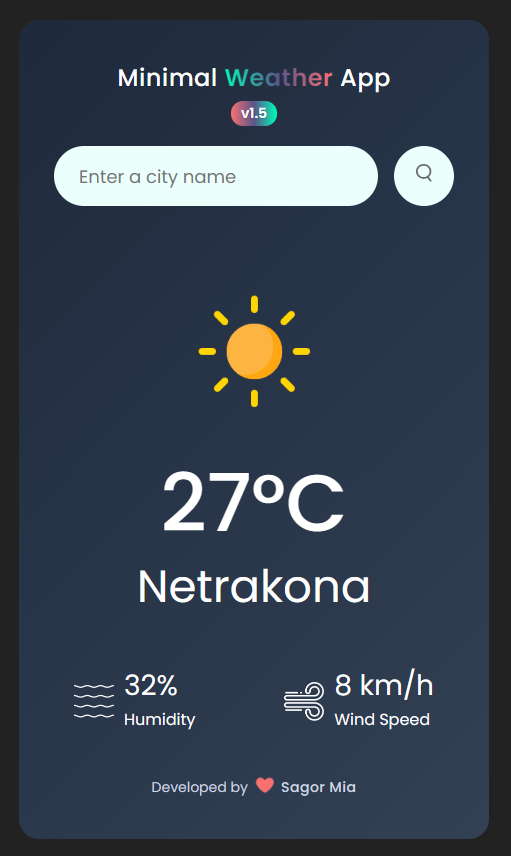
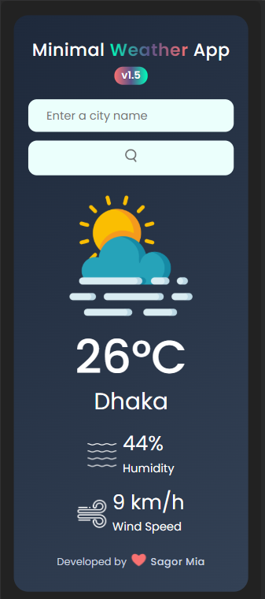

# 🌤️ Minimal Weather App v1.5 Ultimate

A **clean, minimal, and responsive weather application** built using **HTML,
CSS, and JavaScript**.  
Users can search for any city and view **real-time weather information** with
smooth animations and a polished UI.

---

## 🚀 Features

- Search weather by **city name**
- Supports search via **Enter key** or button click
- Real-time **temperature, humidity & wind speed**
- Dynamic **weather icons**
- Animated **placeholder with last searched city**
- **Gradient blinking cursor** in input field
- Smooth **fade-in transitions**
- Responsive design for **desktop, tablet, and mobile**
- Remembers **last searched city** using localStorage
- User-friendly **error handling**

---

## 🛠️ Built With

- HTML5
- CSS3 (with gradients and animations)
- JavaScript (ES6+)
- OpenWeatherMap API

---

## 📸 Preview

---

## 🌐 Live Demo

Check out the fully functional app here:
[Minimal Weather App v1.5 Ultimate](https://minimal-weather-info.netlify.app)

---

## 📦 Version

**v1.5 Ultimate** – Fully responsive with animated placeholders, blinking
cursor, Enter key support, and polished UI

---

## 👨‍💻 Author

Developed with ❤️ by **Sagor Mia**

---

## 📄 License

This project is for learning and personal use.
